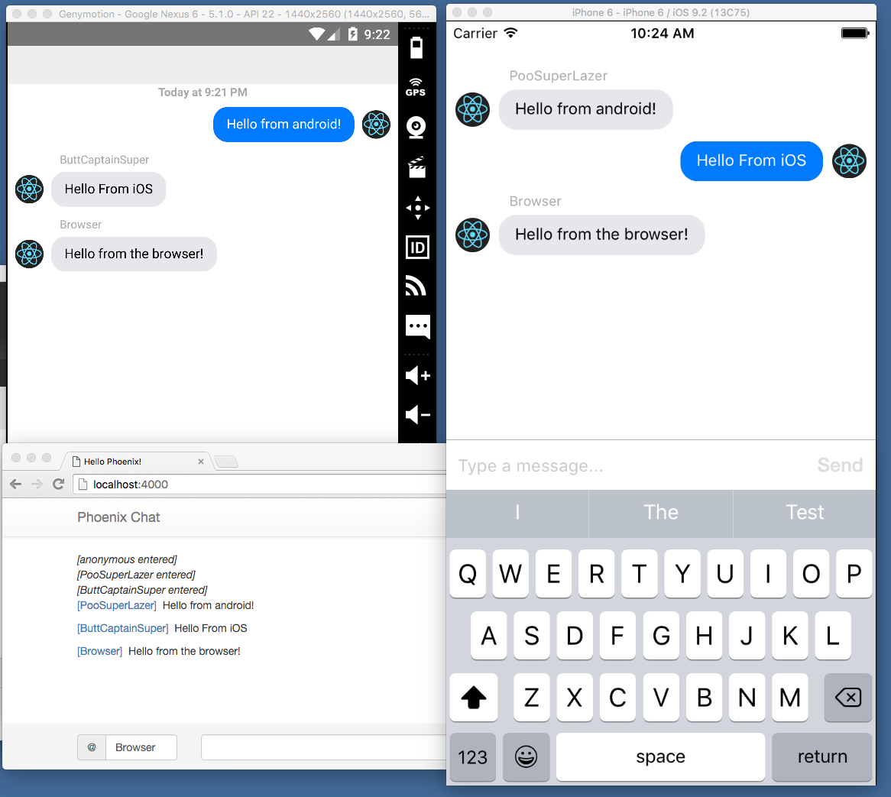

# What is this Foul Sorcery?

Here's an example of using React Native to talk to a Phoenix server with WebSockets.

# About The Client

Since this is just a sample, I'm going to pretend errors and timeouts don't exist.

In the code:

* `Phoenix.js` - the official JS client that ships with Phoenix framework.
* `Chat.js` - a silly wrapper around the Phoenix sockets and channel interfaces.
* `Root.js` - the user interface

The UI revolves around a hilariously fantastic 3rd party component called
Gifted Messenger:

https://github.com/FaridSafi/react-native-gifted-messenger

# About The Server

The server is Chris McCord's example.  Only change I made was to turn off the
server-generated PING message every 5 seconds.

https://github.com/chrismccord/phoenix_chat_example

I only included it here for convenience.  I ghetto-forked it as of at commit
02bbbc8a295542146aef4e347dcbdc5fd0aadd69 on Feb 13, 2016.  It's probably out of
date.  He does a great job of keep it up to date.

# Running The Server

Make sure you've installed Elixir 1.2.2+.

`cd ChatServer`
`mix deps get`
`npm install` (recommended: for a web version of the client)
`grab a coffee`
`mix phoenix.server`

After a quick 1-time compile, your server is now up & running.  If you installed
the web client then browser to http://localhost:4000

# Running The Client

Make sure you have React Native 0.19+ installed on your ride.

`cd ChatClient`
`npm install`
`grab a coffee`
`react-native run-ios` or `react-native run-android`

If you're running android, you might need to reverse map some ports to get to the chat server
by running

`$ANDROID_HOME/platform-tools/adb reverse tcp:4000 tcp:4000`

\o/
